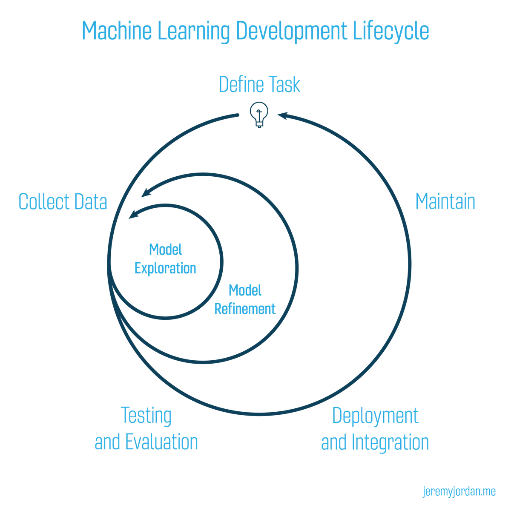

Ce travail intervient dans le cadre de développement de nouvelles pratiques de programmation telles que la Programmation Orientée Objet (POO).
Il s'agit toutefois de la même problématique dégagée dans le répertoire de travail OC_DataScientist_P7. Plusieurs modules ont été crées dans lesquels sont intégrées des classes. L'API construit et utilisé dans ce projet est de type Web RESTful. Ce projet intégre aujourd'hui une application conteneurisée (API + dashboard streamlit partiellement monté sur l'API fastApi) avec Docker pour que vous puissiez le tester chez vous en toute tranquilité sans que vous n'ayez à télécharger des dépendances quel que soit le système d'exploitation que vous utilisez. L'application streamlit récupèrent certaines valeurs et même le modèle de prédiction qu'il est possible de reconstituer dans celle-ci. Vous trouverez la conteneurisation docker via la branche ``docker-app-branch``.

Ci-dessous en image le cycle de vie complet d'un projet ML:

[source medium](https://medium.com/comet-ml/organizing-machine-learning-projects-project-management-guidelines-2d2b85651bbd)
